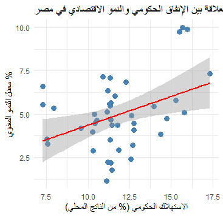
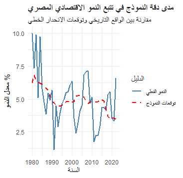

# 🇪🇬 تحليل محركات النمو الاقتصادي في مصر (1980-2022)
### دراسة تحليلية باستخدام لغة R وبيانات البنك الدولي

## 📌 نبذة عن المشروع
هذا المشروع يقدم تحليلاً اقتصادياً قياسياً (Econometrics) يهدف إلى فهم وقياس العلاقة بين **الإنفاق الحكومي الاستهلاكي** و**معدلات نمو الناتج المحلي الإجمالي** في جمهورية مصر العربية. تم الاعتماد على بيانات رسمية من البنك الدولي للفترة ما بين 1980 و2022.

---

## 📊 النتائج الرئيسية (Key Findings)
بعد معالجة البيانات وتحليلها، توصلت الدراسة للنتائج التالية:
*   **الارتباط (Correlation):** توجد علاقة طردية قوية بنسبة **0.39** بين الإنفاق والنمو.
*   **معامل التأثير (Beta):** كل زيادة بنسبة **1%** في الإنفاق الحكومي تقابلها زيادة قدرها **0.33%** في معدل النمو.
*   **المعنوية الإحصائية:** النموذج معنوي جداً بنسبة ثقة تفوق **99%** ($P-value = 0.008$).

---

## 📈 التحليل البصري(Visualizations)

### 1. العلاقة بين الإنفاق والنمو (Scatter Plot)
توضح هذه الرسمة توزيع البيانات وخط الاتجاه العام الذي يثبت العلاقة الطردية.
 
 

### 2. النموذج التنبؤي مقابل الواقع (Actual vs Predicted)
هنا نقارن بين معدلات النمو الحقيقية في مصر وبين توقعات النموذج الرياضي الذي قمنا ببنائه.

---

## 🧪 الإطار الرياضي (Mathematical Framework)
تم بناء التحليل وفقاً للآتي:

### 1. نموذج الانحدار الخطي (Linear Regression)
تم تمثيل العلاقة بالمعادلة:
$$Growth_i = \beta_0 + \beta_1 (Gov\_Exp_i) + \epsilon_i$$
حيث تم تقدير المعلمات باستخدام طريقة المربعات الصغرى (OLS).

### 2. اختبار السببية لجرانجر (Granger Causality)
لقياس التتابع الزمني ومعرفة "من يسبب من"، استخدمنا الاختبار التالي:
$$Y_t = \alpha_0 + \sum_{i=1}^k \alpha_i Y_{t-i} + \sum_{j=1}^k \beta_j X_{t-j} + u_t$$
*   **النتيجة:** قيمة $P-value = 0.103$ مما يشير إلى أن العلاقة قد تكون لحظية أو تأثرية متبادلة وليست سببية تتابعية بسيطة.

---

## لأدوات والتقنيات (Tech Stack)
*   **لغة البرمجة:** R
*   **المكتبات الأساسية:** 
    *   `WDI`: لجلب البيانات مباشرة من البنك الدولي.
    *   `tidyverse`: لتنظيف ومعالجة البيانات.
    *   `ggplot2`: لإنتاج الرسوم البيانية الاحترافية.
    *   `lmtest`: لإجراء اختبارات السببية.
